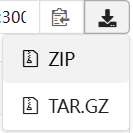

<h1>Десктопное приложение "Пиши-стирай"</h1>

# Описание

Данный проект реализовывает десктопное приложение предназначенное магазина по продаже канцелярских товаров "Пиши-стирай" для обеспечения безопасной и удобной авторизации в системе, доступа к списку товаров магазина для эффективного взаимодействия с ними, такого как добавление в заказ, поиск, сортировку и фильтрацию. Приложение предоставляет функции для формирования заказа, сохранения талона в PDF формате, а также вывод всех заказов из базы данных и возможность редактирования их.

# Технологии и инструменты разработки

Приложение было создано с использованием следующих технологий и инструментов:

- **Язык программирования**: C#
- **IDE**: Visual Studio
- **Framework**: Avalonia UI
- **UI-библиотека**: ReactiveUI
- **Архитектурный шаблон**: MVVM (Model-View-ViewModel)
- **ORM для работы с базой данных**: Entity Framework Core 
- **База данных**: PostgreSQL 
- **Язык разметки**: XAML 
- **Менеджер пакетов для .NET**: NuGet 

# Особенности проекта

### **Особенности**:
- Была разработана DLL-библиотека с целью формирования списка свободных временных интервалов в графике сотрудника для формирования оптимального графика работы сотрудников.
- Если в качестве параметров метода будут указаны пустые массивы данных о начале времени консультаций и их длительности, время начала работы позже времени окончания или другие неподходящие данные, то метод будет обрабатывать исклчючения, тем самым обрабатывая возможные возникновения ошибок. 
- Также для данной DLL-библиотеки было разработано 10 модульных тестов.

Пример кода с методом реализации DLL-библиотеки представлен ниже:

    namespace SF2022User_NN_Lib
    {
        public class Calculations
        {
            public static string[] AvailablePeriods(TimeSpan[] startTimes, int  [] durations, TimeSpan beginWorkingTime, 
                TimeSpan endWorkingTime, int consultationTime)
            {
                try
                {
                    if (startTimes == null || durations == null)
                        throw new ArgumentNullException("Входные массивы не     могут быть пустыми");
                    if (startTimes.Length != durations.Length)
                        throw new ArgumentException("Массивы времени начала и   длительности должны иметь одинаковую длину");
                    if (consultationTime <= 0)
                        throw new ArgumentException("Время консультации должно  быть больше нуля");
                    if (beginWorkingTime >= endWorkingTime)
                        throw new ArgumentException("Время начала работы должно     быть раньше времени окончания");

                    List<string> FreeTimeIntervals = new List<string>();
                    List<(TimeSpan start, TimeSpan end)>    BeginningAndEndWorkingDay = new List<(TimeSpan, TimeSpan)> ();

                    for (int i = 0; i < startTimes.Length; i++)
                    {
                        BeginningAndEndWorkingDay.Add((startTimes[i], startTimes    [i].Add(TimeSpan.FromMinutes(durations[i]))));
                    }

                    BeginningAndEndWorkingDay = BeginningAndEndWorkingDay.  OrderBy(slot => slot.start).ToList();

                    TimeSpan currentStart = beginWorkingTime;

                    foreach ((TimeSpan start, TimeSpan end) slot in     BeginningAndEndWorkingDay)
                    {
                        if (currentStart.Add(TimeSpan.FromMinutes   (consultationTime)) <= slot.start)
                        {
                            FreeTimeIntervals.Add($"{currentStart:hh\\:mm}- {slot.start:hh\\:mm}");
                        }

                        if (currentStart < slot.end)
                        {
                            currentStart = slot.end;
                        }
                    }

                    if (currentStart.Add(TimeSpan.FromMinutes   (consultationTime)) <= endWorkingTime)
                    {
                        FreeTimeIntervals.Add($"{currentStart:hh\\:mm}- {endWorkingTime:hh\\:mm}");
                    }

                    return FreeTimeIntervals.ToArray();
                }
                catch (Exception ex)
                {
                    Console.WriteLine($"Ошибка: {ex.Message}");
                    return Array.Empty<string>();
                }
            }
        }
    }

# Начало работы

Чтобы начать работать с проектом, размещённым на Gogs, следуйте этим шагам и условиям:

## Необходимые условия

Перед запуском приложения убедитесь, что ваш локальный компьютер соответствует следующим требованиям:

1. Операционная система

   - Windows 10 или выше
   - macOS 10.14 (Mojave) или выше
   - Linux (с поддержкой необходимых библиотек)

2. Процессор

   - Минимум: 2 ядра
   - Рекомендуется: 4 ядра или больше для оптимальной работы

3. Оперативная память

   - Минимум: 4 ГБ
   - Рекомендуется: 8 ГБ или больше, особенно для ресурсовёмких приложений

4. Место на диске

   - Минимум: 1 ГБ свободного места для установки приложения и зависимостей
   - Рекомендуется: 5 ГБ и более для хранения всех необходимых компонентов и данных
5. Программа-архиватор для распоковки архиватора (на выбор)
    - WinRAR
    - 7-Zip
6. Доступ к интернету для загрузки информации из базы данных

## Установка

- **Откройте** один из браузеров: _Chrome_, _Opera_, _MicrosoftEdge_
- **Перейдите** на сайт по ссылке: **https://github.com/GoncharovaNE/WriteAndErase_App.git**

- **Скачайте** архивный файл (ZIP):

- **Разархивируйте** скаченный файл, найдя файл **WriteAndErase_App.exe** в папке **net8.0** в архиве **bin** (его тоже нужно будет разархивировать) по следующему пути: **WriteAndErase_App >  bin > Debug > net8.0**, запустите приложение нажав два раза на файл **WriteAndErase_App.exe**.

## Авторы
- **Гончарова Надежда** - главный разработчик - [Профиль с другими проектами](https://github.com/GoncharovaNE)
